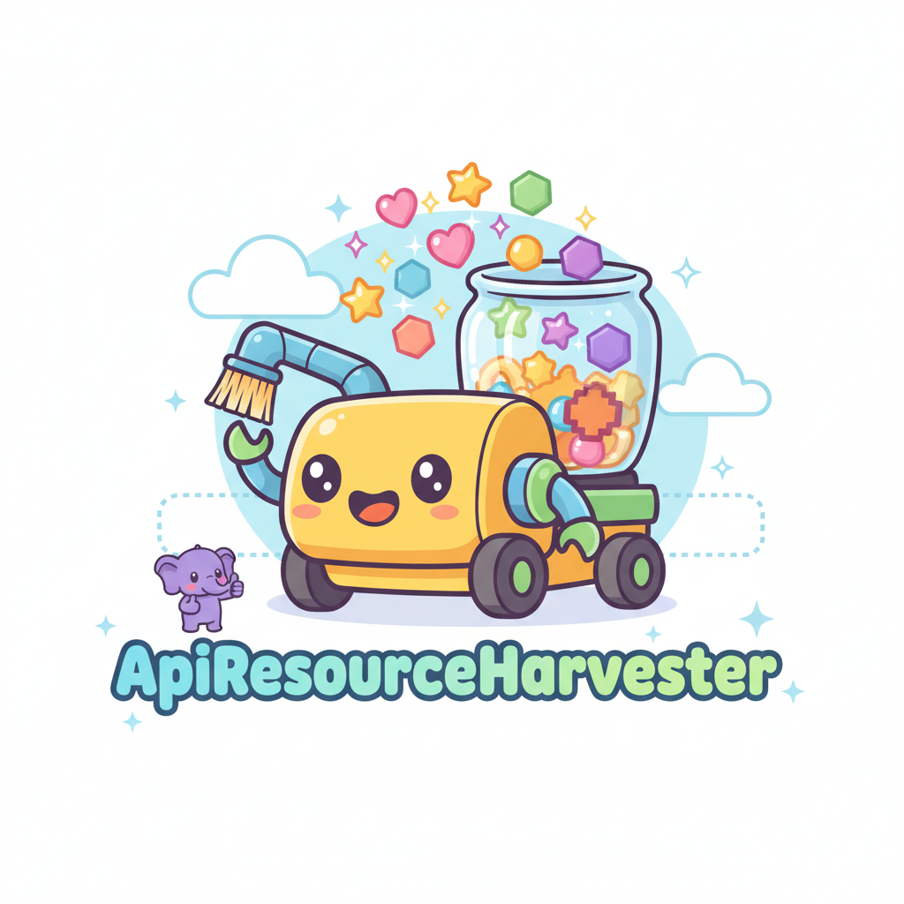

# ApiResourceHarvester



Is a powerful, memory-efficient PHP library designed to simplify the process of retrieving large collections of resources from paginated external APIs (especially REST and JSON-LD endpoints) using the Symfony HttpClient component.

## Installation

Install the library using [Composer](https://getcomposer.org/):

```bash
composer require matawan/api-resource-harvester
```

## Usage

Here is a basic example of how to use the `ApiResourceHarvester` to retrieve a collection of resources from a paginated API.

```php
<?php

require 'vendor/autoload.php';

use Matawan\ApiResourceHarvester\ApiResourceHarvester;
use Symfony\Component\HttpClient\HttpClient;
use Symfony\Component\Serializer\Encoder\JsonEncoder;
use Symfony\Component\Serializer\Normalizer\ObjectNormalizer;
use Symfony\Component\Serializer\Serializer;

// Create a Symfony HttpClient
$httpClient = HttpClient::create();

// Create a Symfony Serializer
$encoders = [new JsonEncoder()];
$normalizers = [new ObjectNormalizer()];
$serializer = new Serializer($normalizers, $encoders);

// Create the ApiResourceHarvester
$harvester = new ApiResourceHarvester($httpClient, $serializer);

// The initial URL of the paginated API
$initialUrl = 'https://api.example.com/users';

// The Fully Qualified Class Name (FQCN) of the DTO to deserialize the resources into
$outputFqcn = 'App\DTO\UserDTO';

// Harvest the resources
$users = $harvester->harvest($initialUrl, $outputFqcn);

foreach ($users as $user) {
    // Do something with the user DTO
    echo $user->getName() . "\n";
}
```

### Custom Keys

You can also specify custom keys for the items and the next page URL.

```php
$users = $harvester->harvest(
    $initialUrl, 
    $outputFqcn, 
    'items', // The key for the items in the JSON response
    'next_page' // The key for the next page URL in the JSON response
);
```

## Development

This project uses [Docker](https://www.docker.com/) and [Make](https://www.gnu.org/software/make/) to provide a consistent development environment.

### Prerequisites

-   [Docker](https://docs.docker.com/get-docker/)
-   [Make](https://www.gnu.org/software/make/)

### Makefile Commands

-   `make install`: Install dependencies with `composer install`.
-   `make test`: Run the `phpunit` test suite.
-   `make cs-fix`: Fix coding standards with `php-cs-fixer`.
-   `make cs-check`: Check for coding standards violations.
-   `make ci`: Run all the CI checks (`cs-check` and `test`).